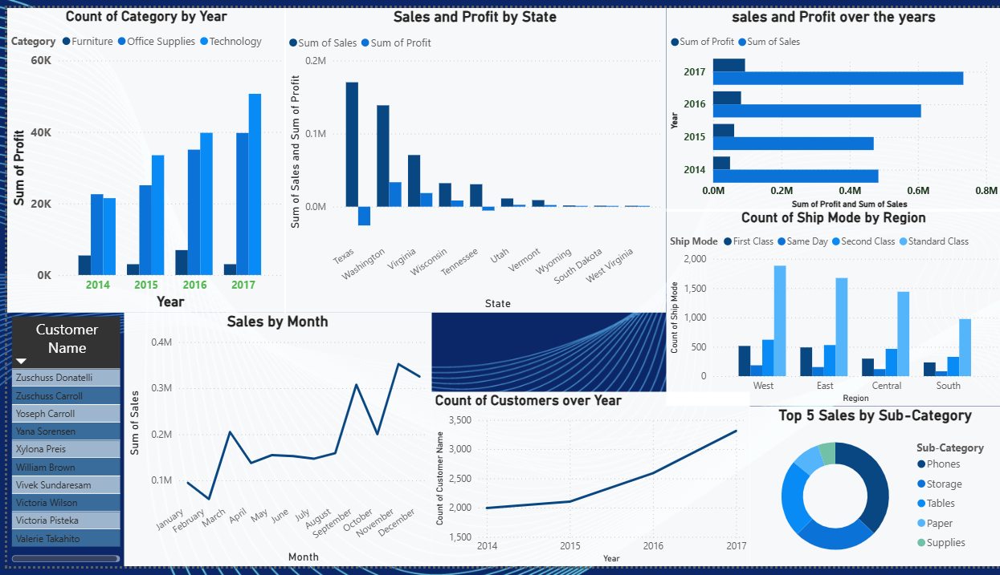

# Superstore Sales Analysis Dashboard

## Project Overview
An end-to-end data analysis project using the Sample 
Superstore Sales dataset with 9,994 rows of sales data 
from 2014 to 2017.

## Tools Used
- SQL(SQLite) — data exploration and analysis
- Power BI — interactive dashboard and visualization

## Dataset
- 9,994 rows, 21 columns,  Years: 2014 to 2017

## Dashboard Preview

## Key Insights
- West region has the highest sales
- Technology is the most profitable category
- Customer base grew consistently from 2014 to 2017
- Standard Class is the most used shipping mode

## Files
- 'da p1 dashboard.pbix' — Power BI dashboard file
- 'DA p1 .vs.sql' — SQL queries used for analysis
